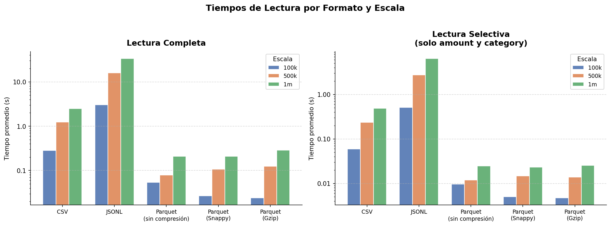
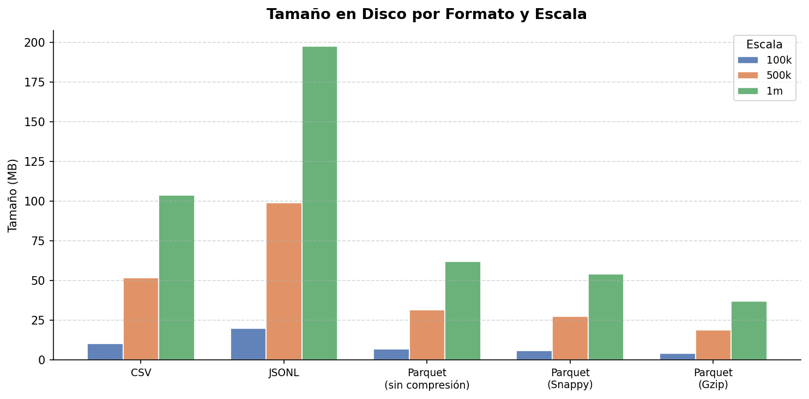

# Ejercicio 1 — Formatos Bajo la Lupa

## Tabla comparativa por escala

### Escala: 100,000 registros

| Formato            | Write avg (s) | Read full (s) | Read selectiva (s) | Tamaño en disco (MB) | Pico RAM (MB) |
|--------------------|--------------|--------------|-------------------|----------------------|--------------|
| CSV                | 0.3779       | 0.2831       | 0.0593            | 10.36                | 23.99        |
| JSON Lines         | 0.3284       | 3.0436       | 0.5089            | 19.76                | 233.62       |
| Parquet (sin comp) | 0.0950       | 0.0544       | 0.0096            | 6.91                 | 7.24         |
| Parquet (Snappy)   | 0.0760       | 0.0270       | 0.0050            | 5.98                 | 5.83         |
| Parquet (Gzip)     | 0.9599       | 0.0240       | 0.0047            | 4.16                 | 4.10         |

### Escala: 500,000 registros

| Formato            | Write avg (s) | Read full (s) | Read selectiva (s) | Tamaño en disco (MB) | Pico RAM (MB) |
|--------------------|--------------|--------------|-------------------|----------------------|--------------|
| CSV                | 1.9081       | 1.2420       | 0.2349            | 51.82                | 119.34       |
| JSON Lines         | 1.9110       | 15.9973      | 2.7452            | 98.82                | 1168.49      |
| Parquet (sin comp) | 0.2615       | 0.0795       | 0.0120            | 31.46                | 30.65        |
| Parquet (Snappy)   | 0.2961       | 0.1063       | 0.0147            | 27.49                | 26.35        |
| Parquet (Gzip)     | 3.2826       | 0.1251       | 0.0139            | 18.81                | 18.07        |

### Escala: 1,000,000 registros

| Formato            | Write avg (s) | Read full (s) | Read selectiva (s) | Tamaño en disco (MB) | Pico RAM (MB) |
|--------------------|--------------|--------------|-------------------|----------------------|--------------|
| CSV                | 4.0175       | 2.5005       | 0.4858            | 103.65               | 238.53       |
| JSON Lines         | 3.9509       | 33.6684      | 6.4434            | 197.64               | 2337.21      |
| Parquet (sin comp) | 0.5432       | 0.2099       | 0.0246            | 61.98                | 59.76        |
| Parquet (Snappy)   | 0.5328       | 0.2089       | 0.0232            | 54.20                | 51.82        |
| Parquet (Gzip)     | 6.0110       | 0.2869       | 0.0254            | 36.93                | 35.35        |

---

## Gráficas

### Tiempos de lectura por formato y escala

### Tamaño en disco por formato y escala

---

## Conclusiones del Benchmark de Formatos de Datos

### ¿Por qué Parquet es tan rápido frente a CSV y JSONL?

Lo que más salta a la vista en los resultados es la velocidad de lectura. Con 1 millón de registros, leer el CSV toma **2.5 segundos** y el JSONL unos **33.7 segundos**. En cambio, Parquet Snappy lo hace en **0.21 segundos**. Esto es 12 veces más rápido que el CSV y más de 160 veces más rápido que el JSONL. Esta diferencia tiene que ver con la arquitectura interna de cada formato.

CSV y JSONL trabajan **por filas**: guardan la información registro por registro. Para leer algo, el programa tiene que revisar cada byte de principio a fin, identificar comas o saltos de línea y convertir todo ese texto a números en la memoria. Es un proceso puramente secuencial y pesado para el procesador.

Por otro lado Parquet está **orientado a columnas**: guarda todos los valores de `amount` juntos, los de `category` juntos, y así. Esto le permite al motor de lectura ir directo a la columna que le interesa sin perder tiempo con las demás. Además, incluye metadatos al inicio que le dicen exactamente dónde empieza y termina cada dato, evitando tener que escanear todo el archivo.

### La ventaja de la lectura selectiva

Cuando solo pedimos un par de columnas específicas (como `amount` y `category`), la diferencia es todavía mayor. El CSV mejora un poco (baja a 0.49s), pero Parquet Snappy cambia a **0.023s**. 

El problema con los archivos CSV es que, aunque solo le pidas dos columnas, el programa igual tiene que leer el archivo completo y descartar lo que no le sirve mientras lo procesa. Parquet, gracias a su estructura, literalmente ni toca el 75% del archivo que no se pidió. En un entorno real, donde sueles consultar 2 o 3 columnas de una tabla que tiene decenas, esto ahorra muchísimo tiempo y recursos de disco.

### ¿Qué pasa con JSONL?

JSONL es, por mucho, el que peor rinde. Para 1 millón de registros llega a consumir **2.3 GB de RAM**, que es casi diez veces lo que usa un CSV. Esto pasa porque JSON guarda todo como texto: un número que en Parquet ocupa 7 bytes (binario), en JSON puede ocupar hasta 10 caracteres. Además, tengo entendido que pandas tiene que crear muchos objetos intermedios para convertir esos textos en datos que Python entienda, lo que satura la memoria. Básicamente, JSONL sirve bien para mover datos entre sistemas (APIs), pero no es buena idea usarlo para almacenamiento analítico.

### Escalabilidad:

Al pasar de 100k a 1M de registros, los formatos no escalan igual. El CSV es lineal: si hay 10 veces más datos, tarda casi 10 veces más. El JSONL escala incluso peor (tarda 11 veces más).

Lo curioso es Parquet: en lectura selectiva, el tiempo solo subió unas 2.5 veces para manejar 10 veces más datos. Esto sugiere que gran parte del tiempo se va en "abrir el archivo" y leer la configuración inicial; una vez que arranca, procesar más volumen no le cuesta tanto trabajo extra.

### Escritura: (Gzip vs. Snappy)

Parquet Gzip es el más lento para escribir (6 segundos frente a los 0.5s de Snappy). Tengo entendido que Gzip usa un algoritmo mucho más agresivo para que el archivo ocupe lo menos posible (36.9 MB vs 54.2 MB de Snappy), lo cual podría ser la causa. 

Sin embargo, en lectura son muy parecidos. Como descomprimir es más fácil que comprimir, usar Gzip no castiga tanto la velocidad al leer, pero sí hace que guardar los datos sea un proceso mucho más pesado para el CPU.

---

## Recomendación final

**Para este caso de uso en producción, yo recomendaría Parquet con compresión Snappy.**

Los resultados del benchmark son claros: Snappy es el más equilibrado. Es el más rápido para escribir, su velocidad de lectura es excelente y el tamaño de archivo es bastante razonable.

El CSV se puede quedar como un formato de **intercambio** (para pasar datos a alguien que use Excel o sistemas que no acepten Parquet), pero no como almacenamiento principal. Tardar 2.5 segundos contra 0.2 segundos podría parecer poco, pero en un flujo de trabajo real donde corres consultas todo el día, el tiempo perdido con CSV se vuelve mayor.

JSONL queda totalmente descartado: su consumo de RAM y su lentitud lo hacen inviable para cualquier servidor con recursos limitados.

---

## Registro de Tiempos y Desarrollo

A continuación, detallo los tiempos aproximados que invertí en el primer ejercicio. Los desgloce en tres fases: investigación previa, escritura del código, interpretación de resultados y reporte:

| Fase | Tiempo empleado |
|------|-----------------|
| Investigación previa | 3-4 h |
| Escritura de código | 2-3 h |
| Interpretación y reporte | 3-4 h |
| **Total acumulado** | **8-11 h** |

Este ejercicio, al ser el primero, fue el que me consumió más tiempo en la fase de investigación previa, ya que tuve que familiarizarme con muchos conceptos que no conocía y a que traté de tener una visión general de todo el módulo de ejercicios para comenzar de la mejor forma posible.
